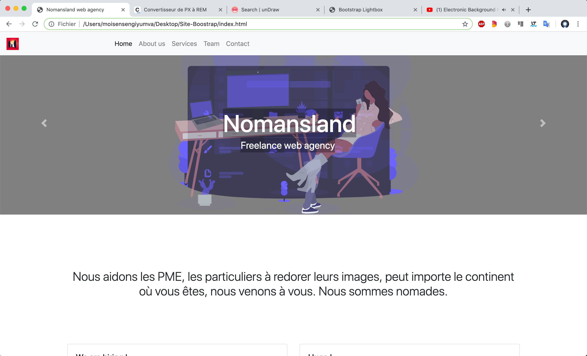

# Site-Boostrap
Start up
Création d'un site web avec le framework Bootstrap. S'arrurer que le tout reste bien responsive. Maîtriser
l'environnement, librairie Bootstrap.

## Un aperçu du site Bootstrap
https://moise-code.github.io/Site-Boostrap/

Le site est principalement fait avec du code Bootstrap, et un peu de css.

**Moïse N** Moise-code
**Réseau** https://www.linkedin.com/in/moïse-nsengiyumva-56593758/
